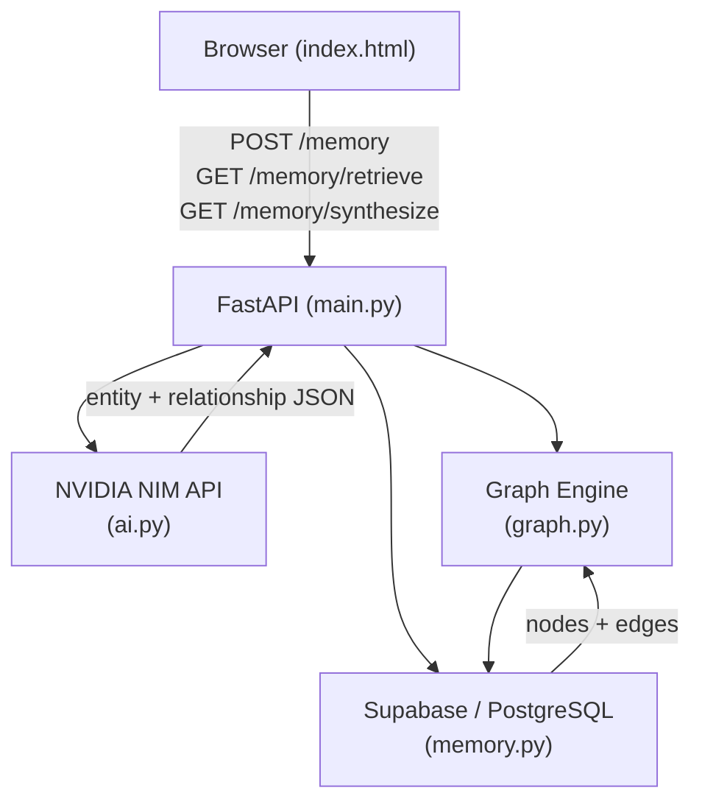
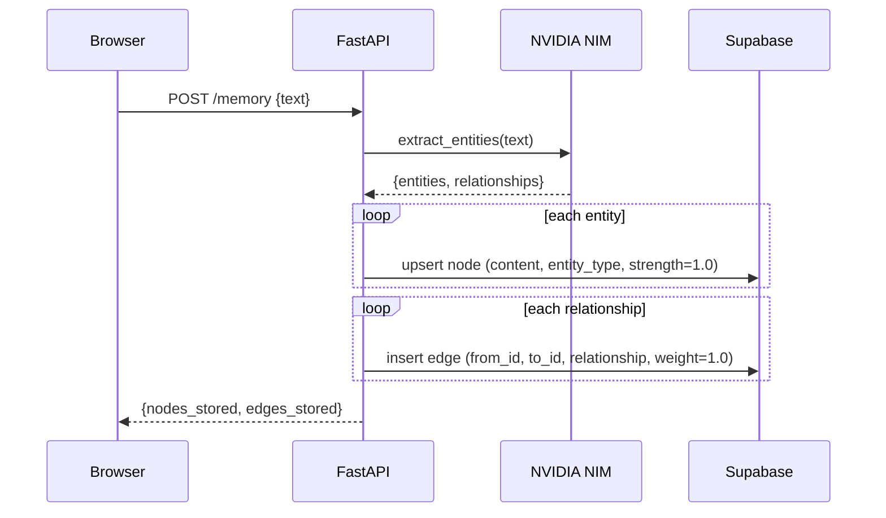
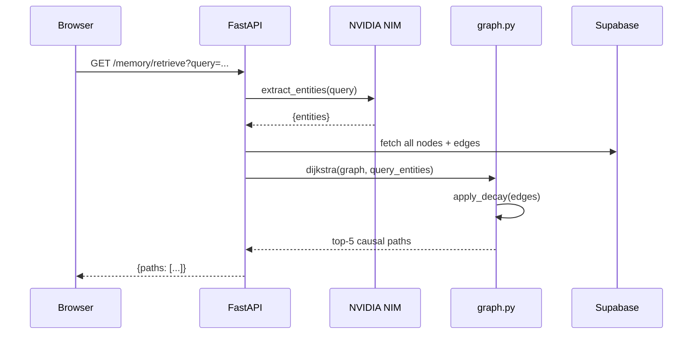
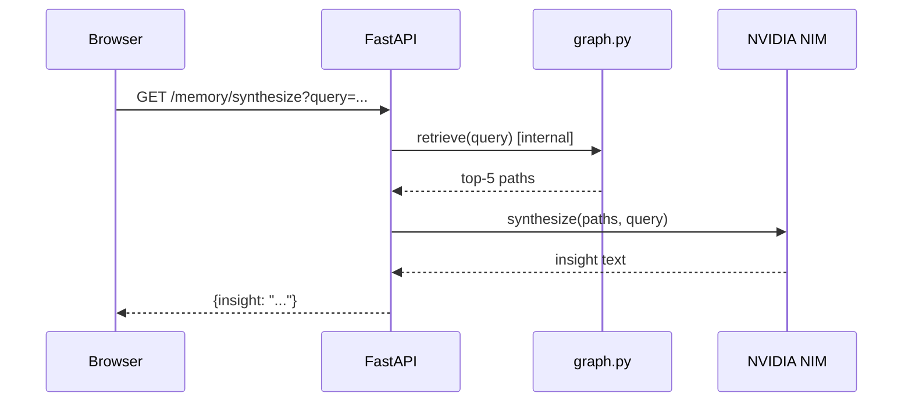

# Design Document: MemoryMesh

## Overview

MemoryMesh is an AI-powered memory engine that stores knowledge as a causal graph and retrieves it using Ebbinghaus forgetting-curve decay. Plain-text input is processed by an LLM (NVIDIA NIM / Llama-3.1-70b-instruct) to extract entities (nodes) and relationships (edges), which are persisted in Supabase (PostgreSQL). On retrieval, a pure-Python Dijkstra traversal finds the shortest causal paths through the graph, edge weights are decayed by `R = e^(-t/S)`, and the resulting paths are optionally synthesized by the LLM into non-obvious insights.

The system is composed of four Python modules (`ai.py`, `memory.py`, `graph.py`, `main.py`) served by FastAPI, plus a zero-dependency single-file HTML frontend. All state lives in Supabase; no local database is required.

MemoryMesh targets personal knowledge management, research note-taking, and long-running AI assistants that need durable, causally-linked memory with natural forgetting behaviour.

---

## Architecture



### Module Responsibilities

| Module | Responsibility |
|--------|---------------|
| `main.py` | FastAPI app, route handlers, CORS, error envelope |
| `ai.py` | NVIDIA NIM API calls — entity extraction and synthesis |
| `memory.py` | Supabase CRUD for `nodes` and `edges` tables |
| `graph.py` | Dijkstra shortest-path + Ebbinghaus decay engine |
| `index.html` | Single-file frontend — store, retrieve, synthesize |

---

## Sequence Diagrams

### Store Memory (`POST /memory`)



### Retrieve Memory (`GET /memory/retrieve`)



### Synthesize Insight (`GET /memory/synthesize`)



---

## Components and Interfaces

### Component 1: `ai.py` — NVIDIA NIM Client

**Purpose**: Wraps the OpenAI-compatible NVIDIA NIM SDK. Provides entity extraction and synthesis as pure functions; no side effects.

**Interface**:
```python
def extract_entities(text: str) -> dict:
    """
    Returns:
        {
            "entities": ["Alice", "Bob", ...],
            "relationships": [
                {"from": "Alice", "to": "Bob", "type": "knows"},
                ...
            ]
        }
    Raises:
        ValueError: if LLM returns non-JSON or missing keys
    """

def synthesize_insight(paths: list[dict], query: str) -> str:
    """
    Returns a plain-text synthesis of non-obvious insights
    derived from the provided causal memory paths.
    """
```

**Responsibilities**:
- Build prompt strings for extraction and synthesis
- Call `client.chat.completions.create()`
- Parse and validate JSON response for extraction
- Return raw text for synthesis

---

### Component 2: `memory.py` — Supabase Data Layer

**Purpose**: All Supabase reads and writes for `nodes` and `edges` tables. Stateless functions; client initialised once at module level.

**Interface**:
```python
def upsert_node(content: str, entity_type: str) -> dict:
    """
    Insert or update a node by content.
    Returns the stored node row including its UUID.
    """

def insert_edge(from_id: str, to_id: str,
                relationship: str, weight: float = 1.0) -> dict:
    """
    Insert an edge between two node UUIDs.
    Returns the stored edge row.
    """

def get_all_nodes() -> list[dict]:
    """Return every row from the nodes table."""

def get_all_edges() -> list[dict]:
    """Return every row from the edges table."""

def update_node_strength(node_id: str,
                         new_strength: float,
                         new_access_count: int) -> None:
    """Persist updated strength and access_count after a retrieval."""

def update_edge_weight(edge_id: str, new_weight: float) -> None:
    """Persist decayed edge weight back to Supabase."""
```

**Responsibilities**:
- Resolve entity text → node UUID (upsert by `content`)
- Expose raw table dumps for graph construction
- Persist decay/strength mutations after every read

---

### Component 3: `graph.py` — Dijkstra + Decay Engine

**Purpose**: Pure-Python graph operations. No third-party libraries; uses only `heapq`, `math`, and `datetime` from the standard library.

**Interface**:
```python
def apply_decay(edges: list[dict]) -> list[dict]:
    """
    For each edge compute:
        decayed_weight = original_weight * exp(-days_elapsed / strength)
    where days_elapsed is derived from edge.created_at and strength
    comes from the source node.
    Returns a new list of edges with a 'decayed_weight' field added.
    """

def build_adjacency(nodes: list[dict],
                    edges: list[dict]) -> dict:
    """
    Build adjacency list keyed by node UUID.
    Value: list of (neighbour_id, decayed_weight, edge_id)
    """

def dijkstra(adjacency: dict,
             source_ids: list[str]) -> dict:
    """
    Run Dijkstra from all source_ids simultaneously
    (multi-source shortest path).
    Returns dist dict: {node_id: (total_cost, path_list)}
    """

def top_paths(nodes: list[dict],
              edges: list[dict],
              query_entities: list[str],
              k: int = 5) -> list[dict]:
    """
    Orchestrates decay → build → dijkstra → rank.
    Returns top-k paths as human-readable dicts.
    """
```

**Responsibilities**:
- Own all graph math (no networkx, no scipy)
- Apply Ebbinghaus decay on every read
- Increase source node strength by 0.1 on access
- Expose a single `top_paths()` facade used by `main.py`

---

### Component 4: `main.py` — FastAPI Application

**Purpose**: Route definitions, CORS setup, request validation, error enveloping.

**Interface** (HTTP routes):
```python
POST   /memory                       # store plain text
GET    /memory/retrieve?query=str    # retrieve top-5 paths
GET    /memory/synthesize?query=str  # LLM synthesis of paths
GET    /health                       # liveness probe
```

**Responsibilities**:
- Mount CORS middleware (allow all origins for local dev)
- Delegate all logic to `ai.py`, `memory.py`, `graph.py`
- Wrap every handler in try/except → `{"error": "..."}` JSON
- Serve `index.html` at `/` (StaticFiles or FileResponse)

---

## Data Models

### Node

```python
class Node(TypedDict):
    id: str            # UUID (set by Supabase)
    content: str       # Entity text, e.g. "Albert Einstein"
    entity_type: str   # e.g. "person", "concept", "event"
    strength: float    # Ebbinghaus stability S; starts at 1.0
    access_count: int  # incremented on every retrieval
    created_at: str    # ISO-8601 timestamp
```

**Validation Rules**:
- `content` must be non-empty string
- `strength` must be > 0 (never reaches 0; guarded in decay formula)
- `access_count` >= 0

### Edge

```python
class Edge(TypedDict):
    id: str            # UUID
    from_id: str       # UUID → nodes.id
    to_id: str         # UUID → nodes.id
    relationship: str  # e.g. "causes", "influences", "contradicts"
    weight: float      # Original weight; default 1.0
    created_at: str    # ISO-8601 timestamp
```

**Derived field** (not stored):
```python
    decayed_weight: float  # computed at read time
```

**Validation Rules**:
- `from_id != to_id` (no self-loops)
- `weight` > 0
- `relationship` non-empty

### API Response Shapes

```python
# POST /memory
class StoreResponse(TypedDict):
    nodes_stored: int
    edges_stored: int
    node_ids: list[str]

# GET /memory/retrieve
class PathNode(TypedDict):
    id: str
    content: str
    entity_type: str

class PathEdge(TypedDict):
    relationship: str
    decayed_weight: float

class MemoryPath(TypedDict):
    path: list[PathNode]
    edges: list[PathEdge]
    total_cost: float

class RetrieveResponse(TypedDict):
    query: str
    paths: list[MemoryPath]

# GET /memory/synthesize
class SynthesizeResponse(TypedDict):
    query: str
    insight: str
    paths_used: int
```

---

## Algorithmic Pseudocode

### Main Algorithm: `apply_decay`

```python
def apply_decay(edges: list[dict], nodes: list[dict]) -> list[dict]:
    """
    Preconditions:
        - edges is a non-empty list of edge dicts with keys:
          id, from_id, weight, created_at
        - nodes is a list of node dicts with keys: id, strength
        - All created_at values are valid ISO-8601 timestamps

    Postconditions:
        - Returns a new list (does not mutate input)
        - Each returned edge has an additional 'decayed_weight' key
        - decayed_weight = weight * exp(-days_elapsed / strength)
        - decayed_weight > 0 for all edges (since exp() > 0)
        - If strength would be 0 (shouldn't occur), clamps to 0.001

    Loop invariants:
        - All edges processed so far have valid 'decayed_weight' values
        - No original edge fields are mutated
    """
    import math
    from datetime import datetime, timezone

    node_strength = {n["id"]: max(n["strength"], 0.001) for n in nodes}
    result = []
    now = datetime.now(timezone.utc)

    for edge in edges:
        created = datetime.fromisoformat(edge["created_at"])
        if created.tzinfo is None:
            created = created.replace(tzinfo=timezone.utc)
        days_elapsed = (now - created).total_seconds() / 86400.0
        S = node_strength.get(edge["from_id"], 1.0)
        decayed = edge["weight"] * math.exp(-days_elapsed / S)
        result.append({**edge, "decayed_weight": decayed})

    return result
```

### Main Algorithm: `dijkstra`

```python
def dijkstra(adjacency: dict, source_ids: list[str]) -> dict:
    """
    Multi-source Dijkstra using a min-heap.

    Preconditions:
        - adjacency: {node_id: [(neighbour_id, cost, edge_id), ...]}
        - source_ids: non-empty list of valid node IDs in adjacency
        - All costs (decayed_weight) are positive floats

    Postconditions:
        - Returns dist: {node_id: (total_cost, [node_id, ...])}
        - dist[src] = (0.0, [src]) for each source
        - For unreachable nodes: not present in dist
        - Shortest path property: for all n in dist,
          no alternative path has lower total_cost

    Loop invariants:
        - Every node popped from the heap has its final shortest distance
        - Nodes in `visited` set have settled distances
        - All relaxed neighbours have dist[n] <= dist[u] + cost(u,n)
    """
    import heapq

    dist = {}
    prev = {}
    heap = []

    for src in source_ids:
        dist[src] = 0.0
        prev[src] = None
        heapq.heappush(heap, (0.0, src))

    visited = set()

    while heap:
        cost, u = heapq.heappop(heap)
        if u in visited:
            continue
        visited.add(u)

        for (v, edge_cost, edge_id) in adjacency.get(u, []):
            new_cost = cost + edge_cost
            if v not in dist or new_cost < dist[v]:
                dist[v] = new_cost
                prev[v] = (u, edge_id)
                heapq.heappush(heap, (new_cost, v))

    # Reconstruct paths
    paths = {}
    for node_id, total_cost in dist.items():
        path = []
        cur = node_id
        while cur is not None:
            path.append(cur)
            cur = prev[cur][0] if prev.get(cur) else None
        paths[node_id] = (total_cost, list(reversed(path)))

    return paths
```

---

## Key Functions with Formal Specifications

### `extract_entities(text: str) -> dict`

```python
def extract_entities(text: str) -> dict:
    ...
```

**Preconditions:**
- `text` is a non-empty string
- `NVIDIA_API_KEY` environment variable is set

**Postconditions:**
- Returns a dict with keys `"entities"` (list of str) and `"relationships"` (list of dicts)
- Each relationship dict has keys `"from"`, `"to"`, `"type"` — all non-empty strings
- Raises `ValueError` if LLM response cannot be parsed as valid JSON
- Does not mutate any external state

**Loop Invariants:** N/A (no loops in this function)

---

### `upsert_node(content: str, entity_type: str) -> dict`

```python
def upsert_node(content: str, entity_type: str) -> dict:
    ...
```

**Preconditions:**
- `content` is a non-empty string
- Supabase client is initialised with valid credentials

**Postconditions:**
- If a node with matching `content` already exists: returns existing row (no duplicate)
- If no matching node: inserts new row with `strength=1.0`, `access_count=0`
- Returned dict always contains `"id"` (UUID string)

---

### `top_paths(nodes, edges, query_entities, k=5) -> list[dict]`

```python
def top_paths(nodes: list[dict], edges: list[dict],
              query_entities: list[str], k: int = 5) -> list[dict]:
    ...
```

**Preconditions:**
- `nodes` and `edges` are non-empty lists from Supabase
- `query_entities` contains at least one entity string
- `k >= 1`

**Postconditions:**
- Returns at most `k` path dicts, sorted ascending by `total_cost`
- Each path dict has keys: `path` (list of node dicts), `edges` (list of edge dicts), `total_cost` (float)
- If fewer than `k` reachable paths exist, returns all reachable paths
- Side effect: calls `update_node_strength` and `update_edge_weight` for accessed nodes/edges

**Loop Invariants:**
- During path ranking: all paths considered so far are valid Dijkstra shortest paths
- Accessed nodes' strength values are monotonically non-decreasing

---

## Example Usage

```python
# ---- Store a memory ----
import requests

resp = requests.post("http://localhost:8000/memory", json={
    "text": "Isaac Newton discovered gravity when an apple fell on his head. "
            "Gravity influences orbital mechanics. "
            "Orbital mechanics enabled space exploration."
})
# {"nodes_stored": 4, "edges_stored": 3, "node_ids": ["uuid1", "uuid2", ...]}

# ---- Retrieve causally linked memories ----
resp = requests.get("http://localhost:8000/memory/retrieve",
                    params={"query": "space exploration origins"})
# {
#   "query": "space exploration origins",
#   "paths": [
#     {
#       "path": [
#         {"id": "...", "content": "Isaac Newton", "entity_type": "person"},
#         {"id": "...", "content": "gravity", "entity_type": "concept"},
#         {"id": "...", "content": "space exploration", "entity_type": "concept"}
#       ],
#       "edges": [
#         {"relationship": "discovered", "decayed_weight": 0.82},
#         {"relationship": "enables",    "decayed_weight": 0.91}
#       ],
#       "total_cost": 1.73
#     }
#   ]
# }

# ---- Synthesize insight ----
resp = requests.get("http://localhost:8000/memory/synthesize",
                    params={"query": "space exploration origins"})
# {
#   "query": "space exploration origins",
#   "insight": "Newton's curiosity about a falling apple set off a chain ...",
#   "paths_used": 3
# }
```

---

## Correctness Properties

1. **Decay monotonicity**: For any edge `e`, `decayed_weight(e, t2) <= decayed_weight(e, t1)` when `t2 > t1` and `strength` is unchanged. (Exponential decay is strictly decreasing in time.)

2. **Strength growth**: After every retrieval that touches node `n`, `n.strength` increases by exactly `0.1`. Access count increments by `1`. Both are idempotent per-call.

3. **Dijkstra correctness**: For any two nodes `u`, `v` reachable in the graph, the returned `total_cost` equals the minimum sum of `decayed_weight` over all paths from any source node to `v`.

4. **Upsert idempotency**: Calling `upsert_node(content, entity_type)` with the same `content` twice always returns the same node UUID and does not create duplicates.

5. **No self-loops**: `insert_edge(from_id, to_id, ...)` raises `ValueError` when `from_id == to_id`.

6. **Path non-emptiness**: `top_paths()` returns an empty list (not an error) when no path exists from any query entity to any other node.

7. **JSON contract**: `extract_entities()` always returns a dict with both `"entities"` and `"relationships"` keys, or raises `ValueError` — it never returns a partial structure.

---

## Error Handling

### Error Scenario 1: LLM returns non-JSON

**Condition**: NVIDIA NIM API returns a message that cannot be `json.loads()`-parsed (e.g., model prefixes the JSON with prose).
**Response**: `ai.py` attempts to extract the JSON substring using regex; if still invalid, raises `ValueError("LLM returned non-JSON response")`.
**Recovery**: `main.py` catches the exception and returns `{"error": "Entity extraction failed: LLM returned non-JSON response"}` with HTTP 422.

### Error Scenario 2: Supabase connection failure

**Condition**: Supabase URL/key invalid, network unreachable, or table missing.
**Response**: `memory.py` propagates the `supabase-py` exception; `main.py` catches and returns `{"error": "Database error: <detail>"}` with HTTP 503.
**Recovery**: No local fallback; operator must fix credentials or connectivity. Supabase client is re-initialised on next request (module-level singleton is safe to reuse after transient errors).

### Error Scenario 3: No entities found for query

**Condition**: LLM extracts zero entities from the query string (ambiguous or very short query).
**Response**: `graph.py` `top_paths()` returns an empty list immediately.
**Recovery**: `main.py` returns `{"paths": []}` with HTTP 200 and logs a warning. Frontend shows "No memory paths found."

### Error Scenario 4: Graph is empty (no nodes/edges yet)

**Condition**: `get_all_nodes()` or `get_all_edges()` returns empty lists on first use.
**Response**: Dijkstra returns empty `dist` dict; `top_paths()` returns `[]`.
**Recovery**: Normal empty response. Frontend shows "Memory is empty — store some memories first."

### Error Scenario 5: NVIDIA API key missing/invalid

**Condition**: `NVIDIA_API_KEY` not set or revoked.
**Response**: OpenAI SDK raises `AuthenticationError`.
**Recovery**: `main.py` returns `{"error": "AI API authentication failed"}` with HTTP 503.

---

## Testing Strategy

### Unit Testing Approach

Test each module in isolation with mocked dependencies:

- `test_graph.py`: Test `apply_decay` with known timestamps, `dijkstra` with hand-crafted graphs, `top_paths` with fixture node/edge lists.
- `test_ai.py`: Mock `openai.OpenAI` client; test JSON parsing, regex fallback, error cases.
- `test_memory.py`: Mock supabase client; test upsert idempotency logic.

Key test cases:
- Decay at t=0 → weight unchanged
- Decay at t=S*ln(2) → weight halved
- Dijkstra on a simple 3-node chain
- Dijkstra with unreachable nodes
- Multi-source Dijkstra selects minimum cost source

### Property-Based Testing Approach

**Property Test Library**: `hypothesis`

Properties to verify:
- For all valid edges and positive time deltas: `decayed_weight <= original_weight`
- For all graphs without negative cycles: Dijkstra returns non-negative costs
- For all texts: `extract_entities` returns either a valid dict or raises `ValueError` (never returns `None`)
- `upsert_node` called N times with same content produces exactly 1 DB record

### Integration Testing Approach

- Spin up a real Supabase local instance (or test project) and run the full POST → GET → synthesize pipeline
- Verify that storing a 3-entity text then querying one of those entities returns a path through the graph
- Verify that strength increases after each retrieval

---

## Performance Considerations

- **Graph size**: Dijkstra is O((V + E) log V). For a personal memory store (< 10,000 nodes), this is well under 100 ms per query.
- **Supabase round-trips**: `get_all_nodes()` and `get_all_edges()` fetch the entire graph on every retrieve request. For > 50,000 rows, switch to filtered queries or an in-memory cache with a TTL.
- **LLM latency**: NVIDIA NIM API calls are the dominant latency (typically 1–3 s). Consider background ingestion via a task queue (e.g., asyncio background task) for POST /memory.
- **Decay update writes**: Each retrieval triggers N edge weight writes to Supabase. Batch these with `upsert` to reduce round-trips.

---

## Security Considerations

- **API keys**: `NVIDIA_API_KEY`, `SUPABASE_URL`, `SUPABASE_KEY` must be loaded from `.env` via `python-dotenv`; never hardcoded or logged.
- **Input sanitisation**: User text is passed directly to the LLM prompt. Prompt injection is mitigated by the strict JSON-only instruction and response validation. No SQL is constructed from user input — all DB access goes through supabase-py parameterised methods.
- **CORS**: FastAPI CORS middleware is set to `allow_origins=["*"]` for local development. In production, restrict to the actual frontend origin.
- **Rate limiting**: No rate limiting in scope for this spec; add a reverse proxy (nginx/Caddy) rate limiter before production deployment.
- **Data privacy**: Memory content is sent to NVIDIA NIM API. Users should be informed; no PII should be stored without consent.

---

## Dependencies

| Package | Purpose |
|---------|---------|
| `fastapi` | HTTP framework, route definitions, CORS middleware |
| `uvicorn` | ASGI server |
| `supabase` | Supabase Python client (supabase-py) |
| `openai` | OpenAI-compatible SDK for NVIDIA NIM API |
| `python-dotenv` | Load `.env` file into environment variables |
| `math` | Built-in — `exp()` for decay formula |
| `heapq` | Built-in — min-heap for Dijkstra |
| `datetime` | Built-in — timestamp parsing for decay |
| `uuid` | Built-in — UUID generation if needed client-side |
| `re` | Built-in — regex fallback for JSON extraction from LLM |
